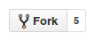
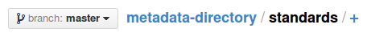

## Using the Metadata Standards Directory

:warning:
Please note that the Metadata Standards Directory Working Group was succeeded by the
Metadata Standards Catalog Working Group, and this Directory has been superseded
by the [Metadata Standards Catalog], with source code available from its
[development repository].

[Metadata Standards Catalog]: https://rdamsc.bath.ac.uk/
[development repository]: https://github.com/rd-alliance/metadata-catalog-v2

This is the source code repository for the
[prototype metadata directory](http://rd-alliance.github.io/metadata-directory/)
set up by the Metadata Standards Directory Working Group of the Research Data Alliance.

* [Visit the standards](http://rd-alliance.github.io/metadata-directory/standards/)
* [Visit the extensions](http://rd-alliance.github.io/metadata-directory/extensions/)
* [Visit the tools](http://rd-alliance.github.io/metadata-directory/tools/)
* [Visit the use cases](http://rd-alliance.github.io/metadata-directory/use_cases/)
* [Browse by subject areas](http://rd-alliance.github.io/metadata-directory/subjects/)

## Contributing to the directory

### [Adding a Standard](http://rd-alliance.github.io/metadata-directory/standards/add.html)

Adding a new standard is as simple as forking the repository creating a new
standards file marked up with a simple YAML schema, commiting your new
standard, and then submitting a
[pull request](https://help.github.com/articles/using-pull-requests) to the
origin repository. Here is a brief set of instructions you can follow to do
this:

 1. If you have not done so already,
    [set up a GitHub account](https://github.com/join).

 2. Fork this repository using the button at the top right. It looks like this:\
    

 3. In your forked copy, navigate to the 'standards' directory. To add a file,
    use the plus sign that appears after the path at the top of the page:\
    

 4. Give your file a sensible file name (lowercase, hyphens instead of spaces,
    ending in a `.md` extension). For the body of the file, use the
    [template provided](http://rd-alliance.github.io/metadata-directory/standards/add.html).
    Delete any bits you don't need.

    If you are unfamiliar with YAML syntax, take a look at some of the
    existing files or the
    [official YAML sample file](http://www.yaml.org/start.html)
    to get a feel for it.

 5. Commit the new file with a message like "Add *(standard name)*".

 6. Press the pull request button when it appears:\
    

 7. You might be asked to provide a title and description for your pull request.
    If so, do that and press the new "Create pull request" button.

 8. You will then see the discussion page we will use when reviewing your
    request. You do not have to do anything else.

If you do not have (and do not want) a GitHub account, but you have Git set up
on your local machine, you can also submit a standard by cloning the
repository locally, committing your changes, and performing a
[`request-pull`](http://git-scm.com/docs/git-request-pull).

Failing that, you can tell us about standards you would like us to include by
[opening an issue](https://github.com/rd-alliance/metadata-directory/issues/new).

### [Adding an Extension](http://rd-alliance.github.io/metadata-directory/extensions/add.html)

By an extension, we mean a profile or other variation of a standard that
enhances or extends it to provide additional functionality, or adapts it for use
in a particular application or context.

The process for contributing an extension is the same as for standards.
The extensions are kept in the 'extensions' directory; please use the
[template provided](http://rd-alliance.github.io/metadata-directory/extensions/add.html).

### [Adding a Tool](http://rd-alliance.github.io/metadata-directory/tools/add.html)

Tools are software tools or systems that support the use of the standard (or an
extension of it) or otherwise implement it.

The process for contributing a tool is the same as for standards.
The tools are kept in the 'tools' directory; please use the
[template provided](http://rd-alliance.github.io/metadata-directory/tools/add.html).

### [Adding a Use Case](http://rd-alliance.github.io/metadata-directory/use_cases/add.html)

By a use case, we specifically mean a repository, data portal, organization,
group, or project that uses the standard. This information is intended to give
users of the directory an impression of the level of adoption, and indicate
possible sources of help using the standard.

The process for contributing a use case is the same as for standards.
The use cases are kept in the 'use_cases' directory; please use the
[template provided](http://rd-alliance.github.io/metadata-directory/use_cases/add.html).

### Additional help with contributing

[Creating and editing files in your repository](https://help.github.com/articles/creating-and-editing-files-in-your-repository)

[Collaboration on GitHub](https://help.github.com/categories/63/articles)

## Hosting your own version

The website is generated with [Jekyll](http://jekyllrb.com). The website uses
Jekyll to process HTML, YAML, and Markdown files to generate a static website.

If you choose to clone the repository running a local version of Jekyll is
helpful for troubleshooting:
[https://help.github.com/articles/using-jekyll-with-pages](https://help.github.com/articles/using-jekyll-with-pages)
